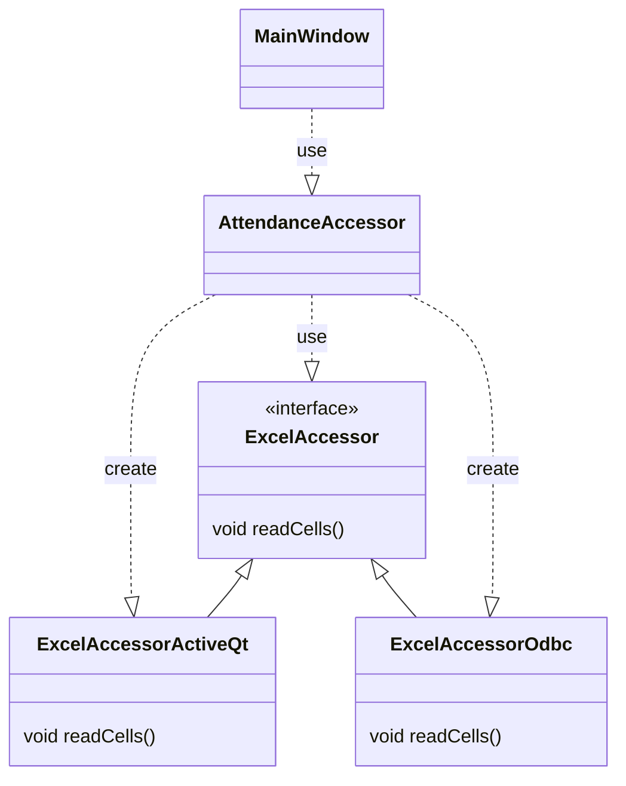

第２段階：AttendanceAccessor周り

```mermaid
classDiagram
    class MainWindow {
    }
    class AttendanceAccessor {
    }
    class ExcelAccessor {
        void readCells()
    }
    <<interface>> ExcelAccessor
    class ExcelAccessorActiveQt {
        void readCells()
    }
    class ExcelAccessorOdbc {
        void readCells()
    }
    ExcelAccessor <|-- ExcelAccessorActiveQt
    ExcelAccessor <|-- ExcelAccessorOdbc
    MainWindow ..|> AttendanceAccessor : use
    AttendanceAccessor ..|> ExcelAccessorActiveQt : create
    AttendanceAccessor ..|> ExcelAccessor : use
    AttendanceAccessor ..|> ExcelAccessorOdbc : create
```
