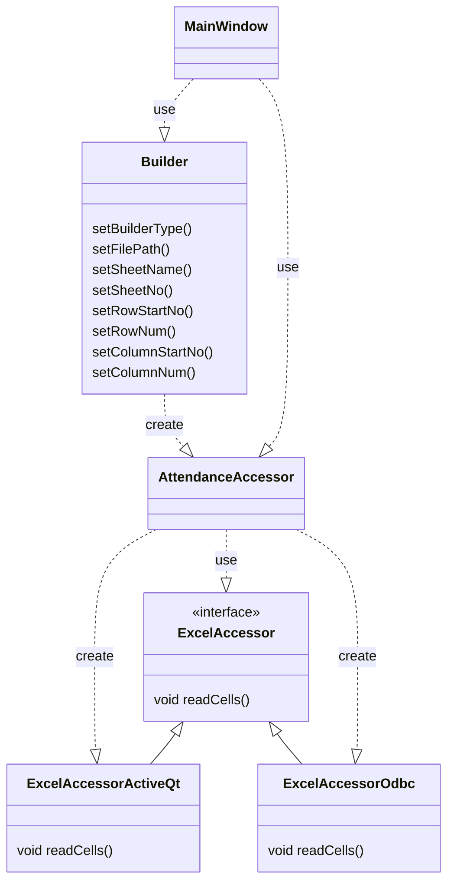

第３段階：BuilderパターンでAttendanceAccessorを生成

```mermaid
classDiagram
    class MainWindow {
    }
    class Builder {
        setBuilderType()
        setFilePath()
        setSheetName()
        setSheetNo()
        setRowStartNo()
        setRowNum()
        setColumnStartNo()
        setColumnNum()
    }
    class AttendanceAccessor {
    }
    class ExcelAccessor {
        void readCells()
    }
    <<interface>> ExcelAccessor
    class ExcelAccessorActiveQt {
        void readCells()
    }
    class ExcelAccessorOdbc {
        void readCells()
    }
    ExcelAccessor <|-- ExcelAccessorActiveQt
    ExcelAccessor <|-- ExcelAccessorOdbc
    MainWindow ..|> Builder : use
    MainWindow ..|> AttendanceAccessor : use
    AttendanceAccessor ..|> ExcelAccessorActiveQt : create
    AttendanceAccessor ..|> ExcelAccessor : use
    AttendanceAccessor ..|> ExcelAccessorOdbc : create
    Builder ..|> AttendanceAccessor : create
```
